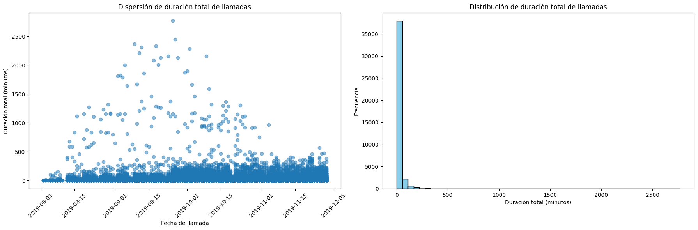
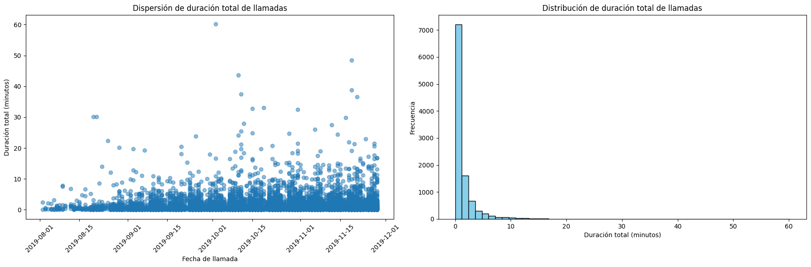
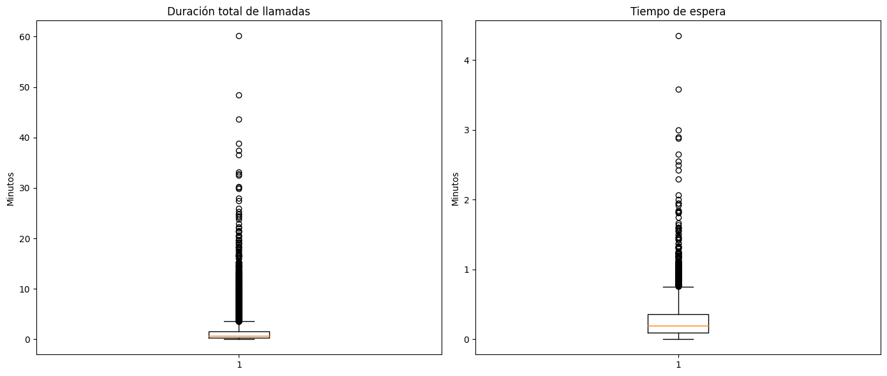
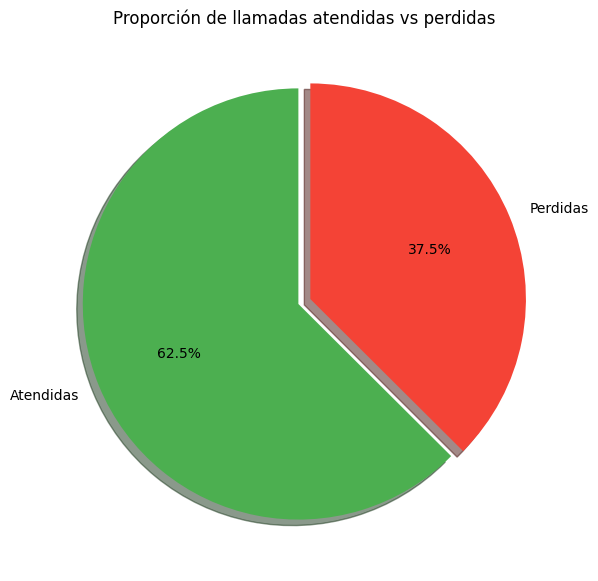

# 📞 Identificación de operadores ineficientes en CallMeMaybe

---

## 📋 Contexto del proyecto

- En este proyecto se analizaron los registros históricos de llamadas de CallMeMaybe, un servicio de telefonía virtual, con el propósito de evaluar el desempeño de sus operadores e identificar posibles patrones de ineficiencia.
- El análisis se centró en explorar la calidad de los datos, estudiar el comportamiento de las llamadas y construir indicadores operativos relacionados con llamadas perdidas, tiempos de atención y actividad de los operadores.
- Durante el desarrollo del proyecto se identificó una limitación importante: la estructura de los datos no permite evaluar de manera confiable el desempeño individual de cada operador, por lo que el análisis se enfoca en identificar tendencias generales del sistema.

---

## 🎯 Objetivos del análisis

### Evaluación operativa

- Analizar la calidad de los datos disponibles.
- Explorar el comportamiento del historial de llamadas.
- Identificar patrones asociados a llamadas perdidas.
- Evaluar la actividad de los operadores.
- Determinar si existen evidencias suficientes para identificar operadores ineficientes.

---

## 🔧 Preparación de los datos

### Objetivo

- Verificar que los registros fueran adecuados para analizar el desempeño operativo.

### Actividades realizadas

- Eliminación de registros duplicados.
- Tratamiento de valores faltantes.
- Conversión de fechas y tiempos.
- Revisión de inconsistencias.
- Filtrado de llamadas individuales.

### Conclusión

- Durante la limpieza se detectó que una gran parte de los registros correspondía a llamadas agregadas y no a llamadas individuales.
- Después del proceso de depuración, únicamente 10,439 registros (19.37 % del conjunto original) fueron considerados válidos para el análisis detallado.

---

## 📊 Análisis Exploratorio de Datos (EDA)

### 1. Calidad de los datos

- **Objetivo:** Evaluar el estado inicial del conjunto de datos antes del análisis.
- **Gráfica:**

- **Conclusión:** Se identificaron miles de registros duplicados, valores faltantes y llamadas con duración igual a cero, lo que evidenció la necesidad de realizar una limpieza exhaustiva antes de cualquier análisis.

### 2. Distribución de la duración de llamadas

- **Objetivo:** Analizar la duración típica de las llamadas registradas.
- **Gráfica:**

- **Conclusión:** La mayoría de las llamadas dura menos de dos minutos y la mediana es cercana a 40 segundos, lo que sugiere un gran número de llamadas interrumpidas, abandonadas o finalizadas rápidamente.

### 3. Llamadas perdidas

- **Objetivo:** Cuantificar la proporción de llamadas que no fueron atendidas.
- **Gráfica:**

- **Conclusión:** Cerca del 30 % de las llamadas registradas fueron perdidas. Este resultado coincide con la corta duración observada y representa una oportunidad importante para mejorar la calidad del servicio.

### 4. Actividad de los operadores

- **Objetivo:** Comparar el volumen de actividad entre operadores.
- **Gráfica:**

- **Conclusión:** Se observaron diferencias importantes en el número de llamadas registradas por operador; sin embargo, la estructura de los datos impide determinar si estas diferencias reflejan realmente un mejor o peor desempeño individual.

---

## 📈 Resultados

### Principales hallazgos

- Se eliminaron registros duplicados y valores inconsistentes.
- Solo el 19.37 % de los registros correspondía a llamadas individuales.
- La duración mediana de las llamadas fue cercana a 40 segundos.
- Aproximadamente 30 % de las llamadas fueron perdidas.
- La información disponible no permite evaluar objetivamente el desempeño de cada operador.

---

## 📌 Conclusión

- El objetivo inicial consistía en identificar operadores ineficientes mediante el análisis de su actividad.
- El estudio demostró que la principal limitación se encuentra en la calidad y estructura de los datos, ya que múltiples llamadas fueron registradas como una sola observación, impidiendo medir con precisión el desempeño individual de los operadores.
- Aun con esta limitación, el análisis permitió identificar tendencias relevantes del sistema, como la alta proporción de llamadas perdidas y la corta duración de las interacciones, proporcionando evidencia útil para mejorar tanto la operación del servicio como el proceso de captura de datos.

---

## 💡 Recomendaciones

- Registrar cada llamada como una observación independiente.
- Mejorar el proceso de captura de datos para evitar agregaciones.
- Implementar indicadores de desempeño una vez que los datos sean suficientemente granulares.
- Monitorear de forma continua la tasa de llamadas perdidas.
- Repetir el análisis cuando la calidad de los datos permita evaluar objetivamente a cada operador.
